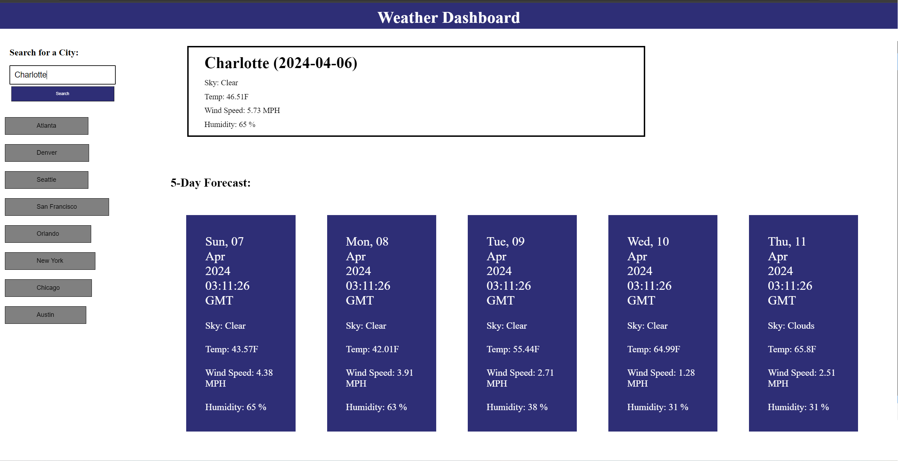

# Weather App
This site was created for my 6th challenge assignment in the UNCC Coding Bootcamp. It is a weather dashboard that allows you to search any city and when the 'search' button is hit, the current and 5 day future forecast of the weather for that city shows up on the screen. This project was created in accordance to the following User Story and Acceptance Criteria.

## User Story
```
AS A traveler
I WANT to see the weather outlook for multiple cities
SO THAT I can plan a trip accordingly
```

## Acceptance Criteria
```
GIVEN a weather dashboard with form inputs
WHEN I search for a city
THEN I am presented with current and future conditions for that city and that city is added to the search history
WHEN I view current weather conditions for that city
THEN I am presented with the city name, the date, an icon representation of weather conditions, the temperature, the humidity, and the wind speed
WHEN I view future weather conditions for that city
THEN I am presented with a 5-day forecast that displays the date, an icon representation of weather conditions, the temperature, the wind speed, and the humidity
WHEN I click on a city in the search history
THEN I am again presented with current and future conditions for that city
```

## How to use

Search for whatever city in the US that you want to see the weather for and click 'Search'

## Links
jregues.github.io/weather-app

## Screenshots



